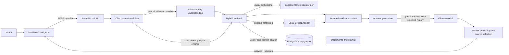
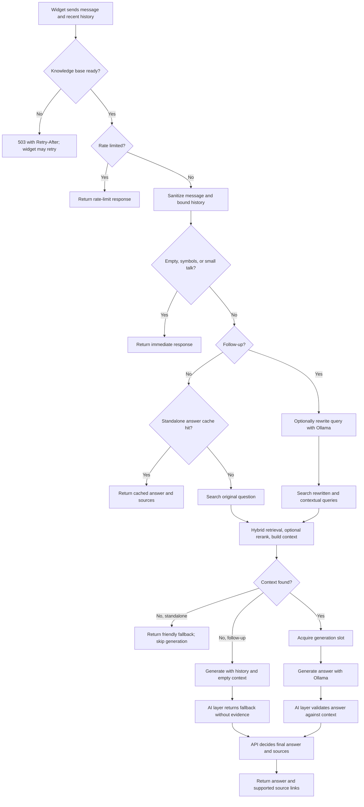

# Chatbot Architecture and Workflow

## System Overview

The chatbot is an embeddable browser widget backed by a FastAPI service. The
service retrieves evidence from PostgreSQL, asks an Ollama language model to
form an answer from that evidence, and returns the answer with source links.
The WordPress integration is the JavaScript widget; it does not run the model
or access the knowledge database directly. Content acquisition and chat
serving are separate workflows: the repository has crawler functions, but the
API startup does not run a crawl.

### Main Components

| Component | Responsibility |
| --- | --- |
| `wordpress/widget.js` | Displays the chat UI, keeps a bounded conversation history in browser memory, sends messages, retries startup responses, and renders source links. |
| `backend/app/main.py` | Creates the FastAPI app, configures CORS and readiness handling, starts knowledge-base and model initialization, and exposes `/health`. |
| `backend/app/api/chat.py` | Implements `POST /api/chat`, validates input/history, handles small talk, follow-ups, caching, retrieval, generation limits, grounding, source selection, and request logging. |
| `backend/app/crawler/` | Discovers URLs from sitemap indexes, extracts page content, and writes JSON snapshots plus a crawl manifest. These functions are not wired to an API route or startup job. |
| `backend/app/knowledge/ingest.py` | Loads JSON snapshots into PostgreSQL and prepares missing chunks and embeddings during bootstrap. |
| `backend/app/services/query_understanding.py` | Rewrites follow-up messages into standalone retrieval queries using Ollama; falls back to the original message if rewriting fails. |
| `backend/app/knowledge/retriever.py` | Embeds the query, combines vector and PostgreSQL full-text candidates, scores and optionally reranks them, then selects relevant chunks. |
| `backend/app/services/rag.py` | Filters and formats selected chunks into a bounded context with source metadata. |
| `backend/app/services/ai.py` | Builds the answer-generation prompt and calls the configured Ollama model. |
| `backend/app/services/grounding.py` | Checks generated claims against retrieved context. The chat API uses this check when deciding whether to expose source links. |
| PostgreSQL (`pgvector/pgvector:pg17`) | Stores documents, chunks, 384-dimensional embeddings, and generated full-text search vectors. |

The local embedding model is `all-MiniLM-L6-v2`; the default optional reranker
is `cross-encoder/ms-marco-MiniLM-L-6-v2`. Both are loaded by the backend
process. Ollama is a separate HTTP service configured through environment
variables such as `OLLAMA_BASE_URL` and `OLLAMA_MODEL`.

## Visitor Request Workflow

The widget sends JSON shaped like `{ "message": "...", "history": [...] }`.
Each history item has a `role` (`user` or `assistant`) and `content`. The API
returns `{ "answer": "...", "sources": [{ "title": "...", "url": "..." }] }`.
History is sent by the browser on each request; the chat API does not use a
server-side conversation store.

In more detail:

1. The readiness middleware rejects chat requests while the knowledge base is
	initializing. The widget retries transient failures, including startup
	responses that include `Retry-After`.
2. The API rate-limits by visitor when configured, sanitizes the message, and
	trims conversation history to configured limits. Empty and symbol-only
	messages get immediate responses. Recognized small talk is answered without
	knowledge retrieval.
3. Standalone messages may use the short-lived in-memory answer cache.
	Follow-ups bypass this cache. For a follow-up, the API may ask Ollama to
	resolve references using recent history; standalone questions are searched
	as written. Contextual query variants may be tried when needed.
4. Retrieval creates a local query embedding and searches PostgreSQL using
	vector similarity and full-text matching. Candidate scores include heading
	signals; optional CrossEncoder reranking and document-aware limits narrow
	the results. The RAG layer filters the candidates and formats a bounded
	context with source metadata.
5. If a standalone question has no context, the API returns a configurable
	friendly fallback without calling the answer model. A follow-up with no
	retrieved context still reaches the AI layer with its selected history, but
	the AI layer returns its fallback for a non-small-talk question without
	evidence; history is not treated as a source of factual grounding.
6. Generation is guarded by a concurrency limit and queue timeout, within the
	overall request timeout. The model receives the question, selected history,
	and retrieved context. The AI layer validates generated text against the
	context. The chat API performs a further grounding check before exposing
	source links; fallback, unavailable, or changed/unsupported answers do not
	include sources.
7. The API returns the answer and source links. It logs request outcomes and
	timing; unanswered questions can optionally be appended to a JSONL file.

## Knowledge-Base Workflow

```mermaid
flowchart LR
	Sitemap[Sitemap index] -. optional external invocation .-> Crawler[Crawler functions]
	Crawler -. writes JSON and manifest .-> Input[backend/data JSON snapshots]
	Input -->|fresh database bootstrap| Load[Knowledge-base loader]
	Load -->|upsert documents| Documents[(documents table)]
	Documents -->|missing chunks| Chunk[Heading-aware chunking]
	Chunk --> Chunks[(chunks table)]
	Chunks -->|missing embeddings| Embed[Local 384-dimension embeddings]
	Embed --> Vector[(chunks.embedding)]
	Chunks --> Text[Generated English tsvector]
	Text --> Search[GIN full-text index]
	Vector --> SearchRequest[Runtime retrieval]
	Search --> SearchRequest
```

`backend/app/crawler/` contains functions to discover sitemap URLs, fetch and
extract page content, and write JSON snapshots and a manifest. It does not
provide a scheduled job, command-line entry point, or API route, so invoking
the crawler and placing its output in the knowledge-base input directories is
an operator workflow. The default bootstrap directories are
`backend/data/raw` and `backend/data/about_poc`.

At application startup, a background loader checks PostgreSQL and repairs
documents that have no chunks and chunks that have no embeddings. It ingests
the default JSON directories only when the database contains no documents;
it does not automatically re-import changed JSON into an already populated
database. The API's readiness flag is set when this loader returns successfully;
an empty database can still complete initialization without any documents to
answer from. A separate background task warms the configured Ollama model when
enabled.

Chunking normalizes text, groups heading-based sections, merges short adjacent
sections, and splits large sections with overlap. `backend/schema.sql` defines
the document and chunk tables and indexes; `content_tsv` is generated from
chunk content, and `embedding` is a pgvector column. Enable the PostgreSQL
`vector` extension and apply the schema before the backend uses the database.
The repository also includes manual maintenance scripts: `chunk_all.py`
rebuilds chunks for stored documents, and `embed_all.py` creates embeddings for
stored chunks. Clear the chat answer cache after changing indexed knowledge so
cached answers do not outlive the update.

## Runtime and Operations

- `docker-compose.yml` starts only PostgreSQL using the pgvector image and a
  persistent database volume. It does not start FastAPI or Ollama and does not
  automatically enable the `vector` extension or apply `backend/schema.sql`;
  initialize both before starting the backend.
- The backend reads PostgreSQL connection settings from environment variables.
  Ollama is a separate service accessed over HTTP; the model name and base URL
  are configured independently.
- `GET /health` reports API status, knowledge-base readiness/counts, and the
  configured Ollama model. The widget may call it to wake or check the backend.
- `POST /api/chat` is mounted by the chat router. CORS origins, model settings,
  retrieval limits, generation controls, caching, and diagnostics are
  environment-configurable.
- The request history belongs to the browser widget, while documents and
  retrieval chunks belong to PostgreSQL. There is no server-side chat transcript
  persistence in this request flow.

For configuration and deployment details, see [DEVELOPMENT.md](DEVELOPMENT.md),
[WORDPRESS.md](WORDPRESS.md), and [SECURITY.md](SECURITY.md).
